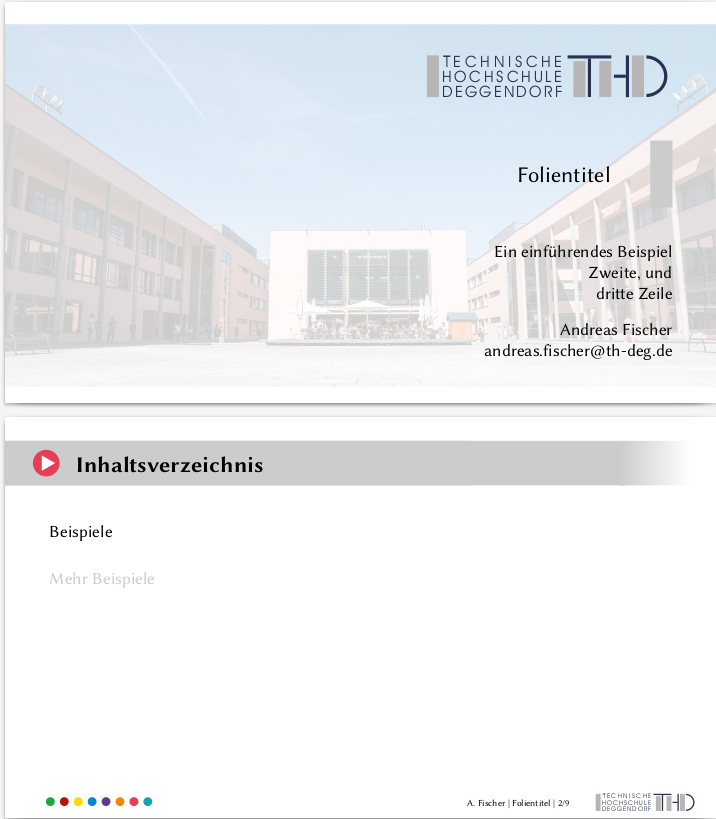
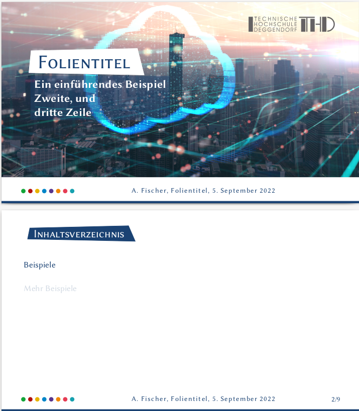

# Studienarbeiten

Dieses Repository enthält eine Vorlage für eine Präsentation mit LaTeX/Beamer.
Der Inhalt der Präsentation befindet sich in `presentation.tex`. Aktuell stehen
zwei Designs zur Auswahl:

* Ein älteres Design, das sich grob am 25-Jahre THD Design orientiert
* Das neuere Design von 2020

Letzteres kann per Option noch auf die Fakultät spezialisiert werden, und verwendet
dann die offiziellen Fakultätsfarbe.

## Beispiel

---
© 2022 [Andreas Fischer](mailto:andreas.fischer@th-deg.de)
